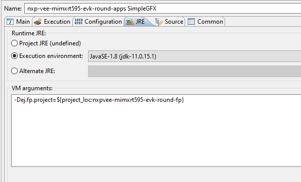

.. Copyright 2023 MicroEJ Corp. All rights reserved.
.. Use of this source code is governed by a BSD-style license that can be found with this software.

Overview
========

Installation
------------

1. Copy the following classes into the front-panel source folder:

   - `<src/main/java/widget/DebugDisplay.java>`__
   - `<src/main/java/widget/UIDrawingWithTraces.java>`__
2. Copy the following html page into the front-panel resources folder:

   - `<src/main/resources/UIFlushVisualizer.html>`__

3. Update the front-panel definition to use the `DebugDisplay` instead of the standard `Display`:

   ::

       <device name="NXP MIMXRT595" skin="Board.png">
           <!-- Original display    <ej.fp.widget.Display x="41" y="33" width="392" height="392" filter="mask_392.png" /> -->

           <!-- Overriden Display -->
           <widget.DebugDisplay x="41" y="33" width="392" height="392" filter="mask_392.png" />

           <ej.fp.widget.Pointer x="41" y="33" width="392" height="392" filter="mask_392.png" touch="true"/>
           <ej.fp.widget.Button label="0" x="823" y="193" skin="button1.png" pushedSkin="button1_pushed.png" listenerClass="ej.fp.widget.ButtonListener"/>
           <ej.fp.widget.Button label="1" x="823" y="228" skin="button2.png" pushedSkin="button2_pushed.png" listenerClass="ej.fp.widget.ButtonListener"/>
       </device>

4. Update the definition of the surface of the display area according to its shape (rectangular display or round display): `<src/main/java/widget/UIDrawingWithTraces.java#L206>`__

   ::

       public int getDrawerArea() {
           // Round display, area is that of a circle.
           return (int) (Math.pow(this.displayWidth / 2, 2) * Math.PI);
   
           // Rectangular display
           // return this.displayWidth * this.displayHeight;
       }

5. Rebuild the VEE Port or configure the launcher to use the front-panel without having to rebuild the VEE Port (cf [the documentation](https://docs.microej.com/en/latest/VEEPortingGuide/frontpanel.html#advanced-test-the-front-panel-project))

By default, the output is configured to `C:\UIFlushVisualizer`.
Set a different location by customizing `rootDir` value: `<src/main/java/widget/DebugDisplay.java#L57>`__

Usage
-----

Please refer to the [documentation](https://docs.microej.com/en/latest/ApplicationDeveloperGuide/UI/Advanced/how-to-microui-flush-visualizer.html).

Requirements
------------

- VEE Port with MICROUI-3.1

Dependencies
============

*All dependencies are retrieved transitively by MicroEJ Module Manager*.

Source
======

N/A

Restrictions
============

None.
